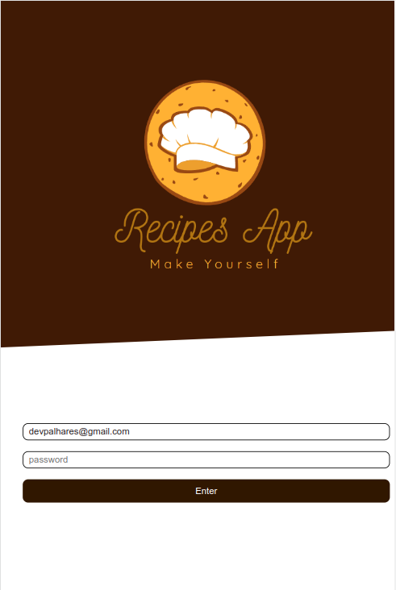
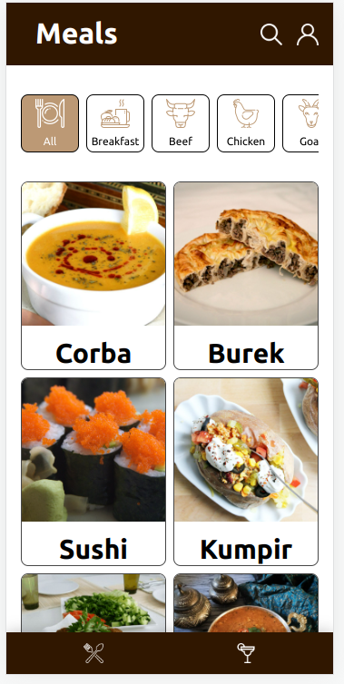
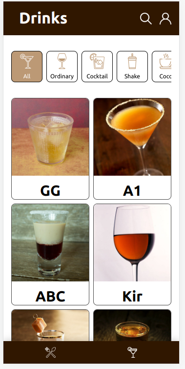
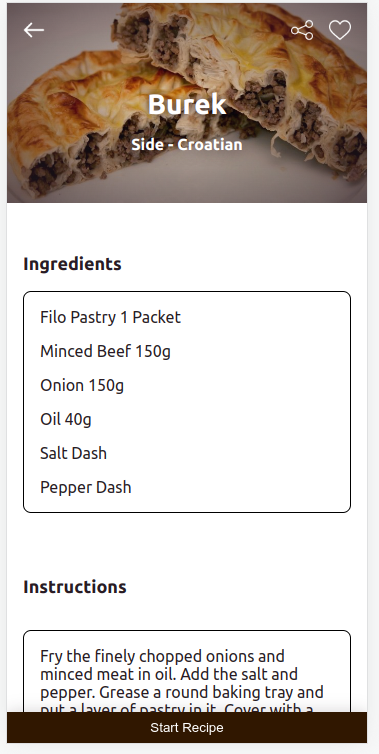
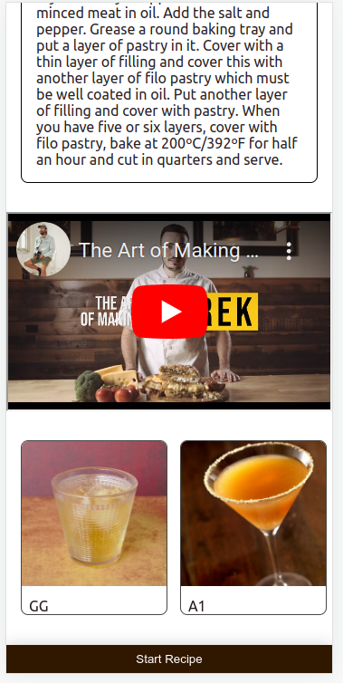

# RECIPES APP

  

 

# O que é? 

O Mais Voce é um aplicativo de receitas de comida e bebida, onde o usuário pode pesquisar por receitas, filtrar por categoria, nome e ingredientes, além de poder favoritar receitas e acessar receitas favoritas.
 

# Features:
## Meals and Drinks Recipes

 
  

 

 
## Ingredientes

## Tutorial Youtube

## Tecnologias utilizadas
- React
- Redux Toolkit
- React Router
- React Hooks
- SCSS

 

# Quem fez? 
- [Pedro Silva](https://github.com/opedrodev)
- [Gabriel Palhares](https://github.com/GPalhares)
- [Gabriel Matina](https://github.com/gabrielmatina)
- [Malu Brandão](https://github.com/malubrandaor)
- [Lucas Daniel](https://github.com/LDRezende)
- [Flavio Ramon](https://github.com/flavioramonnunes)

 

# Como usar? / How to use?
- Live Demo: 
